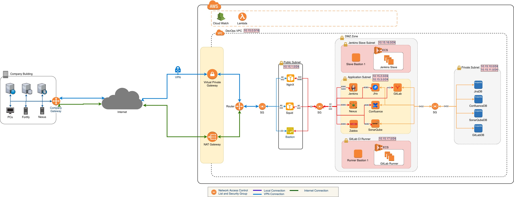

# Infrastructure as Code for DevOps System on AWS

This project buiding on frameworks:
1. Terraform
2. Ansible

## Contents
  1.  [Precondition](#Precondition)

      1.1. [Setup AWS authentication](#Setup-AWS-authentication)

  2.  [Architecture](#Architecture)

      2.1. [Architecture for Hybrid DevOps System](#Architecture-for-Hybrid-DevOps-System)

## Checklist

  - [x] Create network base on Architecture
    - [x] VPC: 10.15.0.0/16
    - [x] Subnet: 7 subnets (1 public subnet, 2 application subnets, 2 agent subnets, 2 private subnets)
    - [x] Router table: Internet > DevOps via Internet gateway, DevOps > Internet via NAT Gateway
    - [x] Gateway: Internet Gateway and NAT Gateway
    - [x] Security Group: Update inbound and outbound for all server
    - [x] EIP: only NAT gateway and NginX server have EIP
  - [x] Create Instances will using as Architecture
  - [ ] Create script for auto install applications
    - [x] Bastion
    - [x] NginX
    - [x] Jira
    - [x] Squid
    - [x] Confluence
    - [x] Sonarqube
    - [x] GitLab
    - [x] Jenkins
    - [x] Nexus Repository
    - [ ] OpenLdap
  - [ ] Lambda function for auto turn-on and turn-off AWS Instances

## Precondition

### Setup Environment

#### Install Terraform
To install Terraform, find the [appropriate package](https://www.terraform.io/downloads.html) for your system and download it. Terraform is packaged as a zip archive.

Another way, you can install by the below way:
* **Install Terraform on MacOS**
```
  brew install terraform
```

* **Install Terraform on Centos 7**

First up, you will need to upgrade your system and packages to current version:
```
$ sudo yum update
```

Next, we will install wget and unzip packages if they’re not already installed:

```
$ sudo yum install wget unzip
```

Now we are ready to download Terraform zip file for Linux from the official website. At the time of writing this article, the current version of Terraform was 0.12.5.

```
$ wget https://releases.hashicorp.com/terraform/0.12.5/terraform_0.12.5_linux_amd64.zip
```

Next, we will unpack the archive to `/usr/local/bin/`

```
$ sudo unzip ./terraform_0.12.5_linux_amd64.zip -d /usr/local/bin/
```

* **Install Terraform on Ubuntu 18.04**

To update the system and packages, you can use the built-in software updater, or manually update the system with:

```
$ sudo apt-get update
```

Again, we will install wget and unzip packages if they’re not already installed:

```
$ sudo apt-get install wget unzip
```

Also next, we will run the same commands as we did with CentOS 7:

```
$ wget https://releases.hashicorp.com/terraform/0.12.5/terraform_0.12.5_linux_amd64.zip
$ sudo unzip ./terraform_0.12.5_linux_amd64.zip -d /usr/local/bin/
```

And finally, to test if our installation was successful:
```
$ terraform -v
```

#### Install Chef InSpec tool

Chef InSpec requires Ruby ( >= 2.4 ).

* The Chef InSpec package is available for MacOS, RedHat, Ubuntu and Windows. Download the latest package at Chef InSpec Downloads or install Chef InSpec via script:

```
# RedHat, Ubuntu, and macOS
curl https://omnitruck.chef.io/install.sh | sudo bash -s -- -P inspec

# Windows
. { iwr -useb https://omnitruck.chef.io/install.ps1 } | iex; install -project inspec
```

* Install it via `rubygems.org`

When installing from source, gem dependencies may require ruby build tools to be installed.

For CentOS/RedHat/Fedora:

```
yum -y install ruby ruby-devel make gcc gcc-c++
```

For Ubuntu:

```
apt-get -y install ruby ruby-dev gcc g++ make
```

To install the inspec executable, which requires accepting the Chef License, run:

```
gem install inspec-bin
```

You may also use inspec as a library, with no executable. This does not require accepting the license. To install the library as a gem, run:

```
gem install inspec
```

### Setup AWS authentication

Create or edit file `~/.aws/credentials` file and add below content to that file:

```
[default]
aws_access_key_id = aaaaaa
aws_secret_access_key = bbbbbbb
```

with 
 - `default` is default profile. Terraform default using this profile for creating infrastructure on AWS
 - `aaaaaa` is access key
 - `bbbbbbb` is secret access key

## Architecture

### Architecture for Hybrid DevOps System



